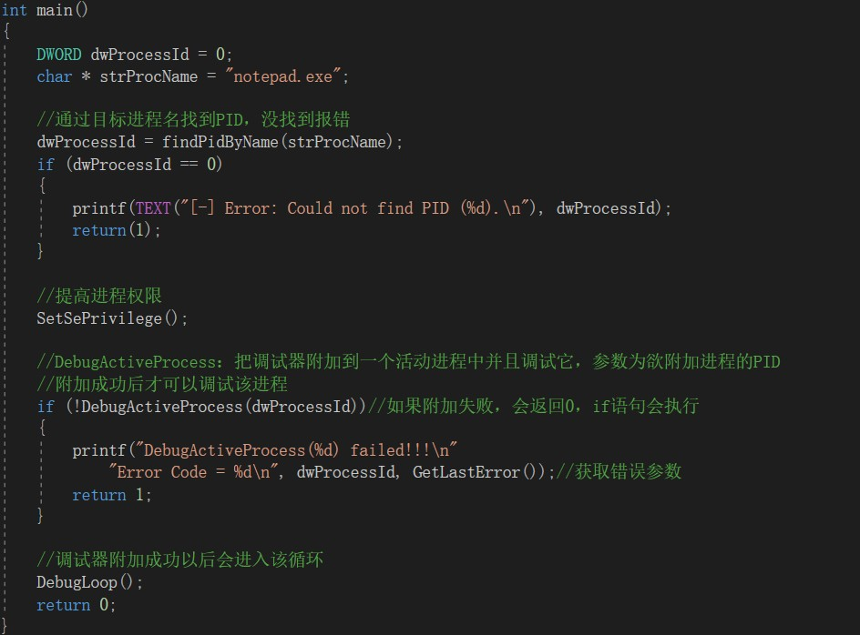
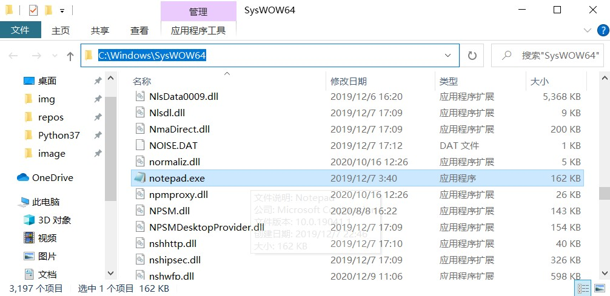
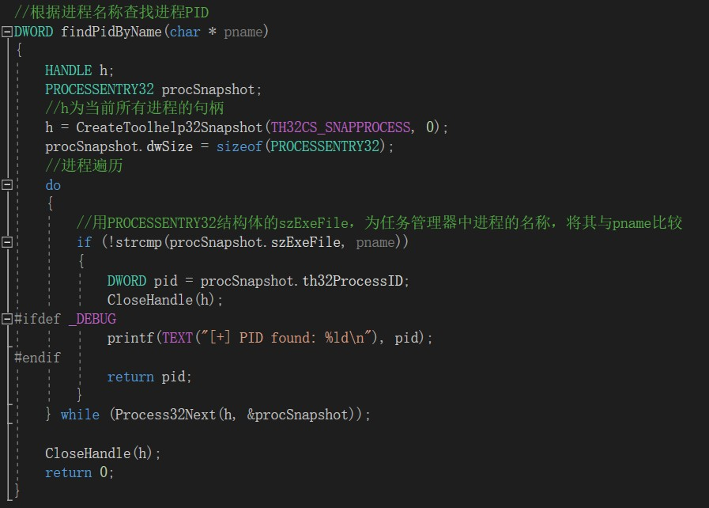
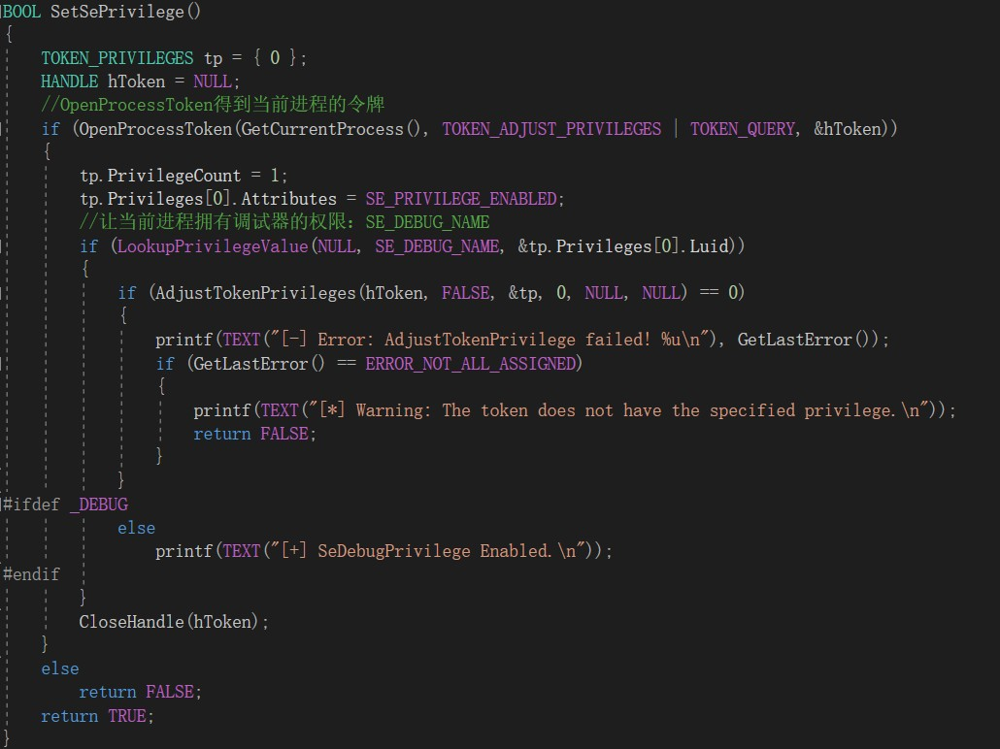
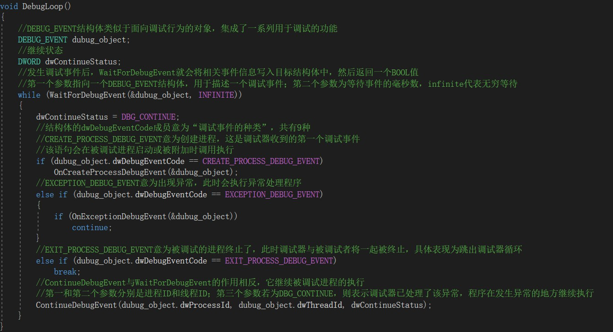
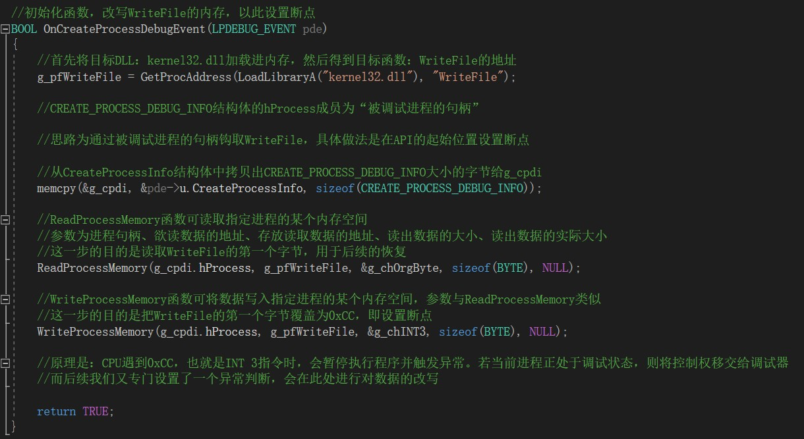
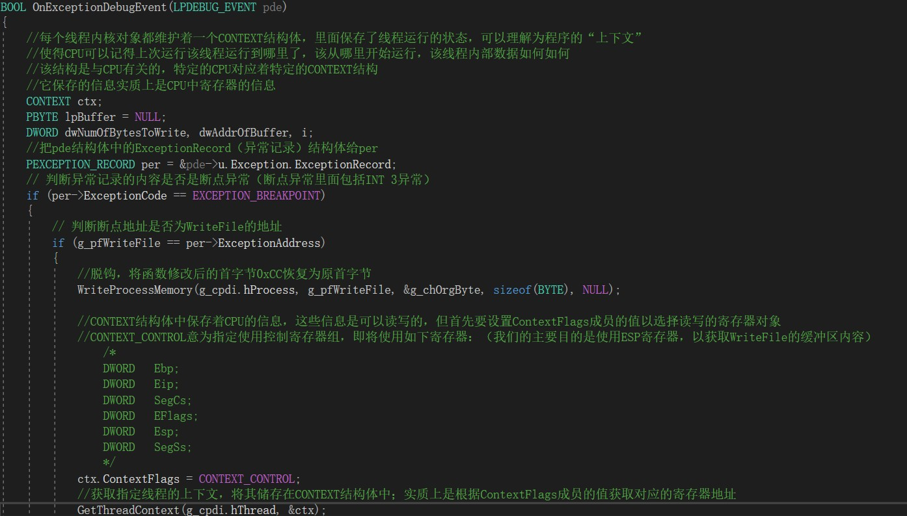
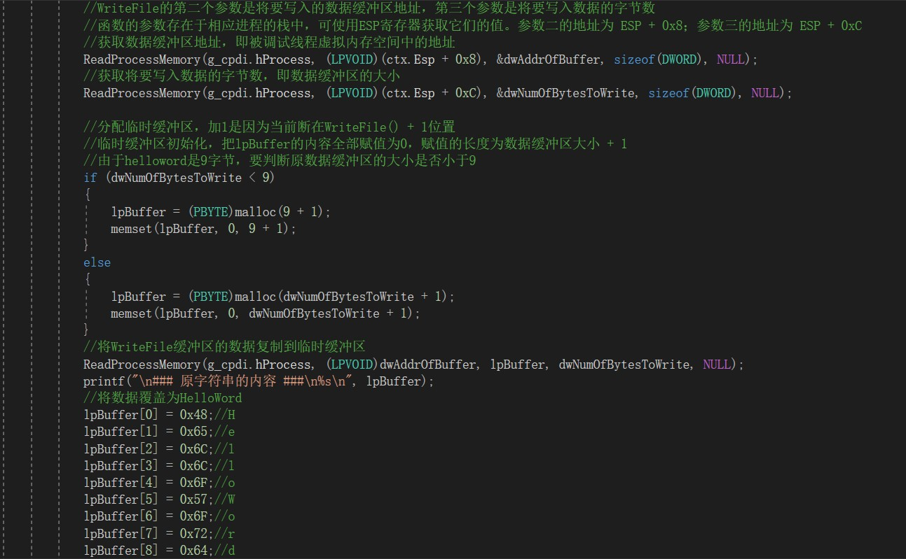

# 结课实验：篡改记事本的储存数据

# 实验目的

hook记事本程序用于保存数据的API：WriteFile()

最终效果是无论txt文件中写的是什么，最终保存下来的文件内容都是一个特定的字符串：HelloWord

# 实验效果展示

演示视频位于`video/演示视频.flv`，请老师查收

# 实验代码的详细讲解

## 简要介绍代码设计思路

1.首先根据进程名：notepad.exe，得到它的进程PID

2.再使用DebugActiveProcess函数，根据PID将调试器附加到目标进程

[DebugActiveProcess函数的官方文档](https://docs.microsoft.com/en-us/previous-versions/aa908990(v=msdn.10))

3.附加成功后，会进入一个由WaitForDebugEvent函数控制的循环，核心就是等待被调试进程发生某些调试事件，并根据事件的类型执行对应操作，共设置3类操作：初始化操作，异常处理操作，退出操作

4.初始化操作：在调试器成功附加到进程上后，会返回初始特征值CREATE_PROCESS_DEBUG_EVENT，在后续的循环中检测到就会执行初始化操作。本质即为：将WriteFile的第一个字节设置为0xCC，触发断点

5.异常处理操作：初始化中人为制造了断点，而触发断点属于异常之一，在循环中检测到就会执行异常处理操作。此时进程拥有调试器权限，可以读写对应寄存器值。核心操作为：获取WriteFile的数据缓冲区地址，将缓冲区中的数据覆盖为指定值。对储存数据内容的篡改就在这一步完成

6.我们需要hook的API：WriteFile会在记事本程序执行保存操作时调用，在点击保存按钮的时候，就会触发异常处理操作

7.退出操作：即退出循环并关闭进程

## 分模块具体讲解

### 1.主函数

主函数的思路很简单，首先通过目标进程名（notepad.exe）找到PID，然后将调试器附加到该进程上（为了成功附加，需要先提升当前进程的权限）。调试器准备完毕后，就进入等待调试事件的循环。

##### tips：我查找的关于寄存器操作、地址细节等资料都是基于32位系统的，因此在这一步附加进程时不能附加到Win10默认的64位记事本程序上，而是要到`C:\Windows\SysWOW64`中的32位记事本程序上

#### 功能函数：findPidByName(char * pname)

该函数的作用是根据进程名称查找进程PID

首先使用CreateToolhelp32Snapshot函数得到当前所有进程的句柄，然后遍历任务管理器中的进程，将进程的名字与设定的字符串对比。如果找到了，就返回它的PID。

#### 功能函数：SetSePrivilege()

要修改一个进程的访问令牌，首先要使用OpenProcessToken函数获得进程访问令牌的句柄，参数分别为：要修改访问权限的进程句柄；指定你所需要的操作类型；返回的访问令牌指针。

获得令牌句柄以后，就可以使用LookupPrivilegeValue函数修改进程权限了，参数分别为：系统的名字，如果为NULL就是本地名字；特权的名字；一个LUID类型的Luid的标识。如果一个进程拥有了SE_DEBUG_NAME的权限，那么它就能调试任何进程了。

最后，还需要AdjustTokenPrivileges函数启用权限，完成最终的修改。

### 2.调试器附加成功以后的循环函数

循环函数由WaitForDebugEvent函数控制，该函数会检测被调试进程所发生的事件，并将其记录到DEBUG_EVENT结构体中。

DEBUG_EVENT结构体的dwDebugEventCode成员就是发生调试事件的类型，共有9种，这里选取初始化、异常、退出3种事件进行操作。

初始化操作会在调试器附加成功后触发，异常处理操作会在点击记事本的保存按钮后触发，退出操作会在退出记事本时触发。

值得注意的一点是：在运行了WaitForDebugEvent函数后，被调试进程会进入“挂起”的状态，为了使进程继续运行，需要ContinueDebugEvent函数，它会结束进程挂起的状态，使其继续运行。

### 3.初始化函数

这一步的目的是改写WriteFile函数的数据，将其第一个字节修改为0xCC，以此设置断点，这样程序在调用WriteFile函数时就会触发断点，从而进入预设的异常处理函数。

具体细节可参考注释，已经写的比较详细了。

### 4.异常处理函数

这里要介绍一下CONTEXT结构体的概念：每个线程内核对象都维护着一个CONTEXT结构体，里面保存了线程运行的状态，可以理解为程序的“上下文”。它使得CPU可以记得上次运行该线程运行到哪里了，该从哪里开始运行。该结构是与CPU有关的，特定的CPU对应着特定的CONTEXT结构，它保存的信息实质上是CPU中寄存器的信息

我们要获取的是ESP寄存器中的信息，为此需要指定CONTEXT结构体的ContextFlags成员的值为CONTEXT_CONTROL。

接下来获取WriteFile函数的数据缓冲区的地址和大小，设置一个临时缓冲区将其保存下来，再用预先设定的字符串“HelloWord”将其覆盖。

将修改后的临时缓冲区内容覆盖到WriteFile函数的缓冲区，至此便实现了数据的改写。然后需要再次设定断点，以配合后续的使用。

# 实验总结

本次实验的目的是实现hook技术，即在系统没有调用该函数之前，hook函数就先捕获该消息并先得到控制权。

这时hook函数可以加工处理该函数的执行行为，还可以强制结束消息的传递，这就实现了我们的最终目标：篡改程序的行为。

hook技术可分为两类，一类是注入式，一类是调试式。注入式hook也可分为两类：DLL注入和代码注入。这些老师在上课时有过介绍，我也跟着动手操作了一些，因此本次实验我想采用另一种技术试试，也就是调试式hook。

它的核心思想是：调试器拥有被调试者的所有权限，所以可以向被调试进程的内存任意设置hook函数。在用户编写的程序中使用调试API附加到目标进程，然后设置hook函数，这样重启运行时就能完全实现API钩取了。