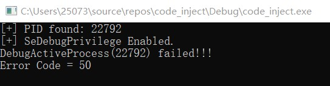

# 问题描述

我在试图将调试器附加到记事本进程上时一直报错，DebugActiveProcess返回的值一直是0

我最开始以为是当前进程权限的问题，查阅资料后得知如果一个进程拥有了 SE_DEBUG_NAME 权限，在执行这一步的时候应该就没问题了

我借鉴了injectAllTheThings的提权代码，在运行时有如下问题：

我猜想这是不是说明权限没问题呢？

最终在控制台中会打印图示信息，我尝试了多次，错误代码一直是50

50的含义是不支持该请求

到这一步我实在是没辙了，这几天我查阅了大量资料，也换了好几种提权方式，可是一直没解决问题，实在是走投无路了，只好来麻烦老师您了

# 程序的目的（供您参考）

hook记事本程序的API：WriteFile()，最终效果是无论使用什么名字保存txt文件，最终保存下来的文件名都是一个指定值，例如helloword.txt

# 程序的设计思路（供您参考）

首先根据进程名得到进程PID（notepad.exe）

再根据PID将调试器附加到目标进程（使用DebugActiveProcess）

DebugActiveProcess函数的官方文档：

附加成功后，会进入如下循环，核心就是等待被调试进程发生某些调试事件，并根据事件的类型进行相应操作

我了解到在调试器成功附加到进程上后，会返回初始特征 CREATE_PROCESS_DEBUG_EVENT ，在后续的循环中检测到后会触发初始化操作

初始化即为：将writefile的第一个字节设置为0xCC，触发断点

触发断点属于异常之一，此后会在循环中检测到异常，进行异常处理操作。此时进程拥有调试器权限，可以读写对应寄存器值。核心操作为：获取WriteFile的数据缓冲区地址，将缓冲区中的数据覆盖为指定值