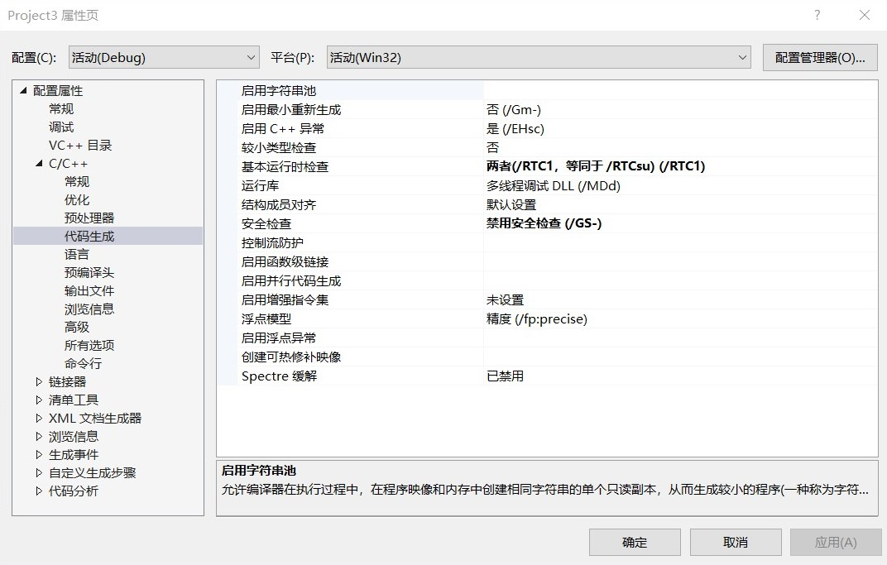
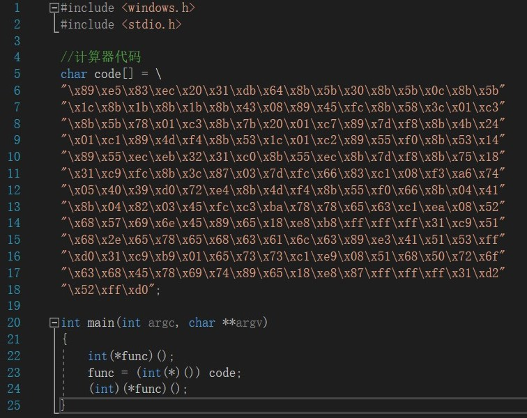
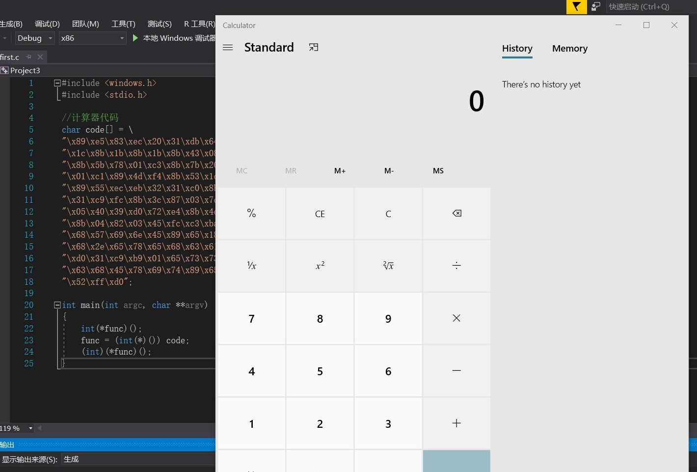
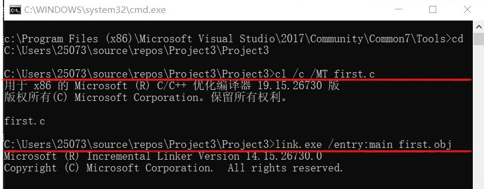
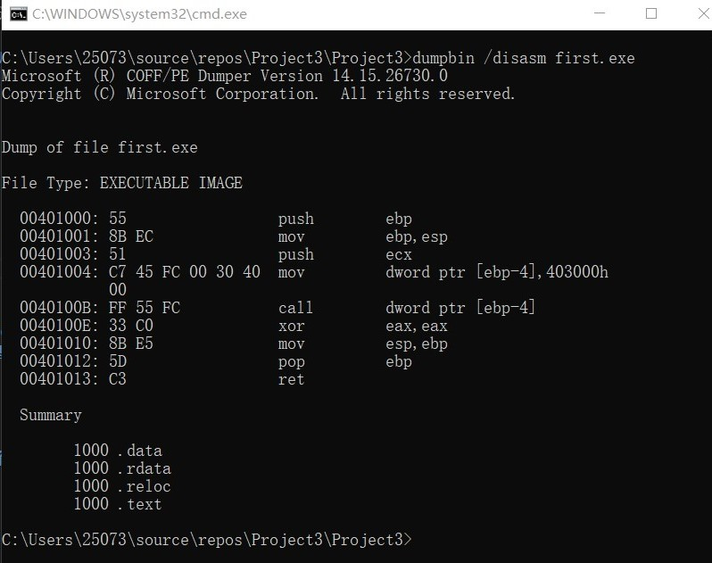
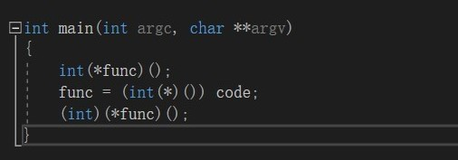
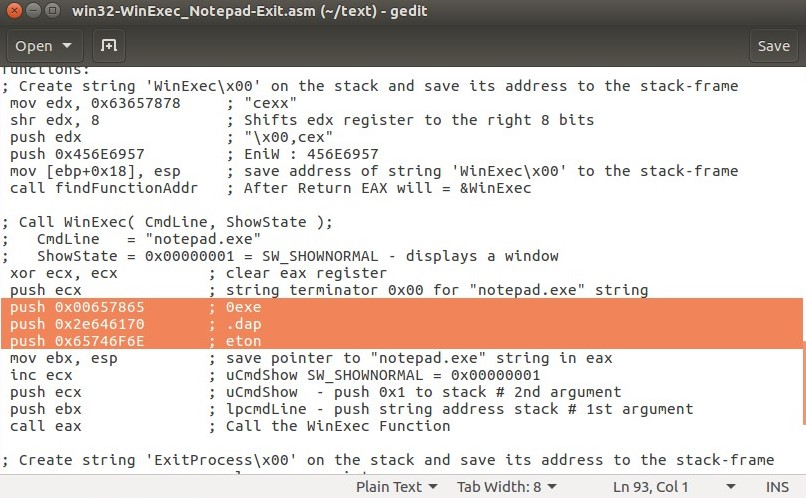
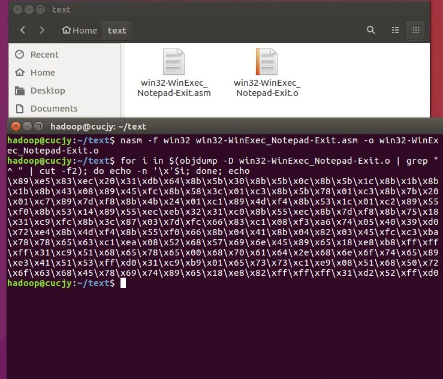
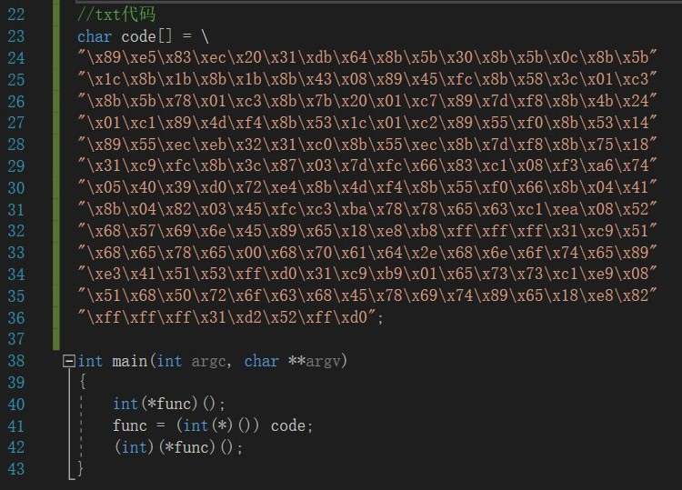
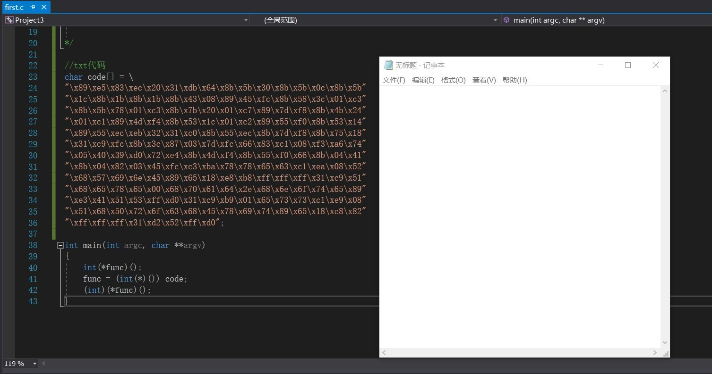

# 逆向工程与软件安全第一次作业

# 4个实验要求均已实现：

## 1.把示例中的shellcode运行成功

### 实验过程：

直接新建.cpp文件运行是无法通过的，需要使用.c文件，然后手动编译、链接、执行。

并且需要在VS中调整项目属性为下图所示：

代码截图：

运行成功截图：

## 2.能从汇编源码编译通过并成功dumpbin

### 实验过程：

编译与链接的过程：

dumpbin的结果：

## 3.自行查阅资料，搜索Windows PEB结构体，PE文件导入表导出表相关数据结构的文档，解读shellcode原理

#### 以下均为我个人学习归纳出的shellcode原理，如有错误疏漏之处，请老师指正：

shellcode是指在目标机器上执行的一段机器码，实现的目标是打开某个程序/执行某个操作。

以示例中的代码为例：

它首先定义一个函数指针，该指针的值应该是一个函数的地址，使用函数指针是为了将函数作为变量使用。接着进行强制类型转换，将code数组的地址赋给了函数指针。此时执行函数，系统就会通过call指令跳转到机器码所在的位置并执行，这就把数字变成了程序。

那么如何制作一个shellcode？

系统正常编译程序时有link阶段，它的目的是调用系统函数，告知程序所调用的API的地址，不然不知道地址是无法使用的。而攻击代码是需要直接嵌入到网络流量中的，没有链接过程，不知道API地址。所以shellcode的一个核心就是寻找目标机器中储存的API地址。这需要PEB结构体以及PE文件导入表导出表配合实现。

PEB是进程环境块，保存进程相关信息。具体的数据结构不在此赘述，我们重点关注它的一个成员：ldr，它是一个指针，指向一个结构体：PEB_LDR_DATA。

而PEB_LDR_DATA结构体又有一个成员：InInitializationOrderModuleList，此成员是一个指针，保存模块链表的头部地址，该链表是一个双向链表。通过地址[PEB_LDR_DATA+0x1C]即可找到InInitializationOrderModuleList成员。

InInitializationOrderModuleList按照顺序保存进程加载的模块基址,其中第一个始终为ntdll.dll,第二个视系统的不同可能保存有Kernel32.dll或KernelBase.dll的信息。不管Kernel32.dll或KernelBase.dll都导出有我们需要的函数GetprocAddress和LoadLibraryEx，而LoadLibrary只在Kernel32.dll导出。

如果你想要获取到函数地址，那么它的DLL必须已经加载到内存中了，如果不在，就要通过函数LoadLibrary将目标DLL加载到内存中。函数GetProcAddress可得到得到其他函数的地址。也就是说，只要得到了函数LoadLibrary和GetProcAddress，就可以得到任何系统函数的地址了。

实际上，一个进程初始化的时候也会遍历链表，寻找API地址，在正常程序中可以很轻松的在反汇编中看到，作为攻击者，其实是手动完成了这些过程。

## 4.修改shellcode功能为运行记事本程序notepad.exe

### 实验过程：

核心为修改字符串“calc.exe”为“notepad.exe”，其他过程均仿照示例执行即可。

由于数据在栈中是逆序存储的，要得到“notepad.exe”，则需我们输入“exe.dapeton”。由于push指令不能超过8位，所以需要将字符串每4个字符分为一组，不足的地方就用0x00来代替，这样就得到了欲拼接的字符串。

具体如图所示：

得到目标汇编代码后，执行命令：

`nasm -f win32 win32-WinExec_Notepad-Exit.asm -o win32-WinExec_Notepad-Exit.o`

得到对象文件，再执行命令：

`for i in $(objdump -D win32-WinExec_Notepad-Exit.o | grep "^ " | cut -f2); do echo -n '\x'$i; done; echo`

得到机器指令：

将该串代码代替原代码中的code：

运行结果：

